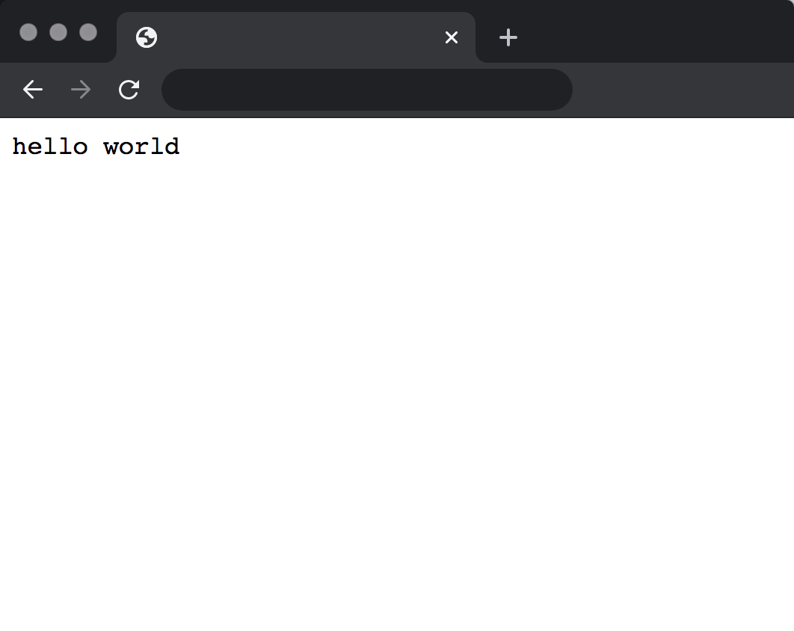

# kubernetes-deploy

Makefiles for creating and deploying to a DigitalOcean-hosted Kubernetes cluster.

# Contents

- [Prerequisites](#prerequisites)
  - [Dependencies](#dependencies)
  - [Authorization](#authorization)
- [Usage](#usage)
  - [Make targets](#make-targets)
    - [Create cluster](#create-cluster)
    - [Destroy cluster](#destroy-cluster)
    - [Authenticate `kubectl`](#authenticate)
    - [Create credentials for DigitalOcean docker registry](#authorize)
    - [Create deployment](#deploy)
        - [Destroy deployment](#destroy)
- ["Hello, World" example](#hello-world-example)

# Prerequisites

## Dependencies

The following dependencies are required:

- `doctl` - Digital Ocean CLI ([install info](https://github.com/digitalocean/doctl#installing-doctl)).
- `kubectl` - Kubernetes command-line tool ([install info](https://kubernetes.io/docs/tasks/tools/install-kubectl/))
- `envsubst` - Linux tool for templating using environment variables ([more info](https://www.gnu.org/software/gettext/manual/html_node/envsubst-Invocation.html)), if your system does not ship with it.

## Authorization

In addition to downloading `doctl` and `kubectl`, you need to authorize against against your DigitalOcean account

- [How to log in to `doctl` with your DigitalOcean account](https://github.com/digitalocean/doctl#authenticating-with-digitalocean)
- [How to authorize `kubectl` to access your DigitalOcean account using `doctl`](https://www.digitalocean.com/docs/kubernetes/how-to/connect-to-cluster/#doctl)

The [`authenticate`](#authenticate) and [`authorize`](#authorize) targets may suffice for connecting to DigitalOcean's Kubernetes and Docker Registry offerings.

# Usage

This project contains a set of make targets for managing a Kubernetes cluster and its deployments.

## Make targets

### Create cluster

```bash
CLUSTER_NAME=your-cluster-name make -C cluster deploy
```

### Destroy cluster

```bash
CLUSTER_NAME=your-cluster-name make -C cluster destroy
```

### Authenticate

Configure `kubectl` command to connect to your cluster.

```bash
CLUSTER_NAME=your-cluster-name make -C cluster authenticate
```

### Authorize

Create secrets to allow your cluster to pull from DigitalOcean's docker registry.

```bash
CLUSTER_NAME=your-cluster-name make -C cluster authorize
```

### Deploy 

Create a new deployment at `./deployment`, or follow the "Hello, World" example below and modify to your needs.

```bash
PROJECT=your-deployment-name make -C deployment deploy
```

### Destroy deployment

```bash
PROJECT=your-deployment-name make -C deployment destroy
```

# "Hello, World" example

This example uses the [`hashicorp/http-echo`](https://hub.docker.com/r/hashicorp/http-echo/) image to run a Kubernetes services that responds to HTTP requests with the text "hello world".

Before completing this example you will need to install dependencies, create a Kubernetes cluster on DigitalOcean, and authorize your local `kubectl` client to access the cluster. Follow documentation above.

## Create the deployment

Run the following command:

```bash
$ PORT=8080 PROJECT=example DOCKER_IMAGE=hashicorp/http-echo make -C deployment deploy
rm example/production.yaml
envsubst < example/template.yaml > example/production.yaml
kubectl apply -f example/production.yaml
deployment.apps/example-production configured
service/example-production-lb configured
```

## Ensure pod successfully started:

```bash
$ kubectl get pods
NAME                                  READY   STATUS    RESTARTS   AGE
example-production-57b9c4bc5c-4tbfr   1/1     Running   0          14m
```

## Wait for LoadBalancer

Run the following command:

```bash
kubectl get services
```

The `EXTERNAL-IP` field will display as pending. Wait for the load balancer to have an `EXTERNAL-IP`. Once it does, you can navigate to that IP address in your browser.

You can also get the IP address with this one-liner:

```bash
$ kubectl get service example-production-lb | grep -v NAME | awk '{print $4}'
161.0.0.1
```

| Hello World Example |
| --- |
|  |

## Cleanup

To destroy this deployment, run the following command:

```bash
$ PROJECT=example make -C deployment destroy
kubectl delete -f example/production.yaml
deployment.apps "example-production" deleted
service "example-production-lb" deleted
```
